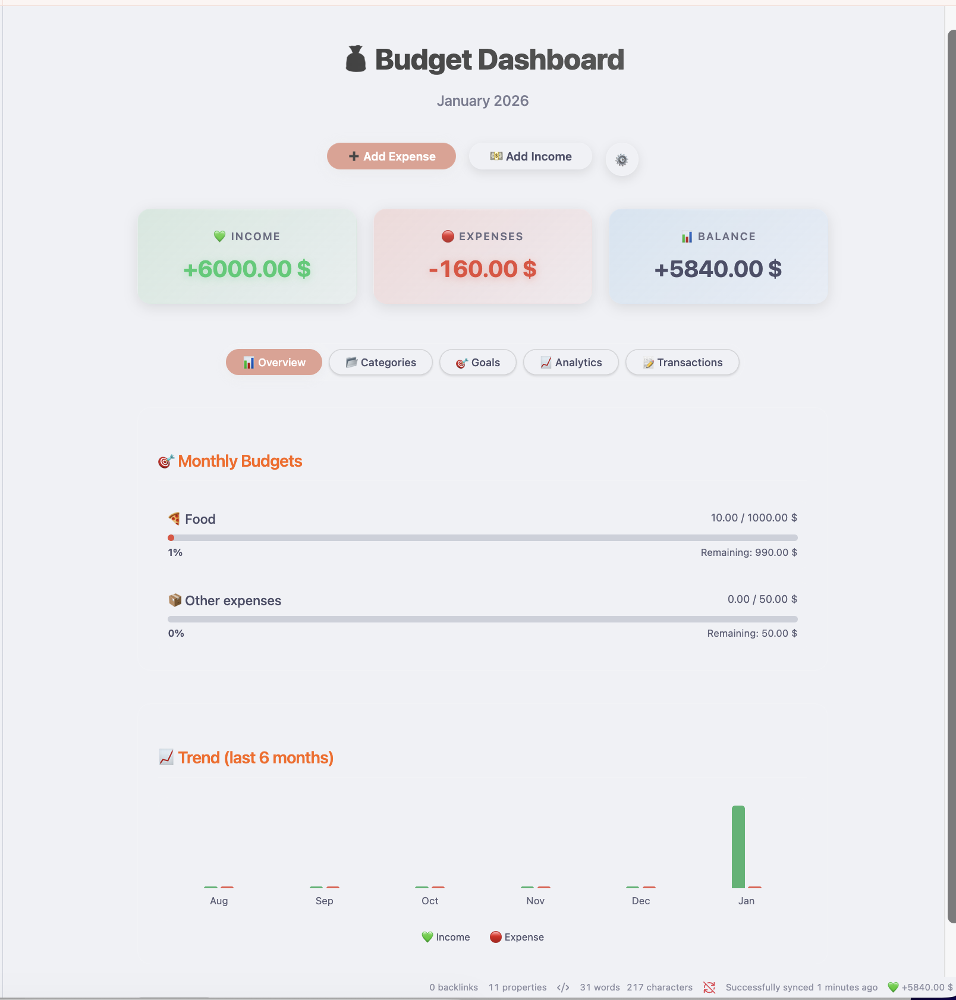
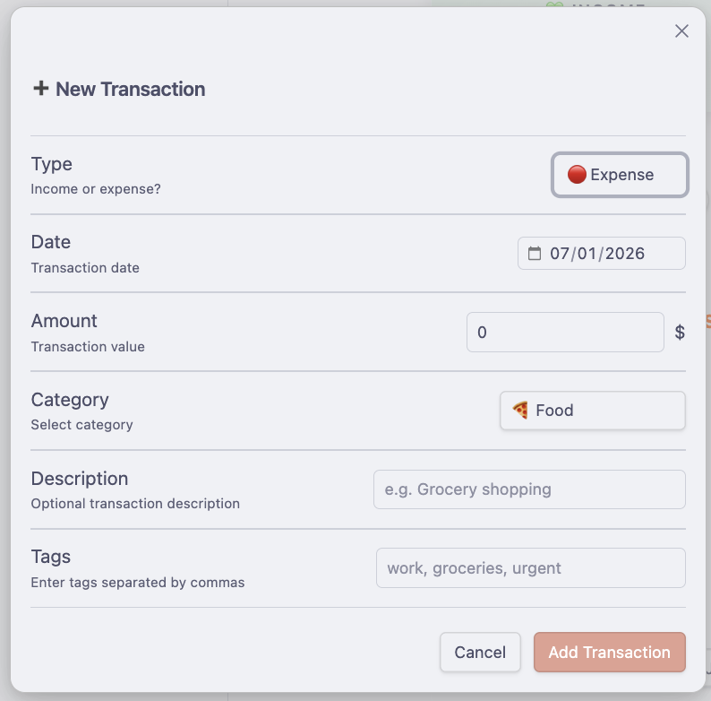
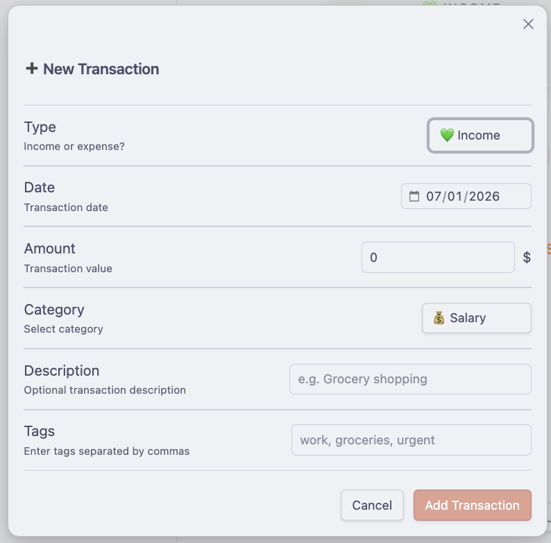
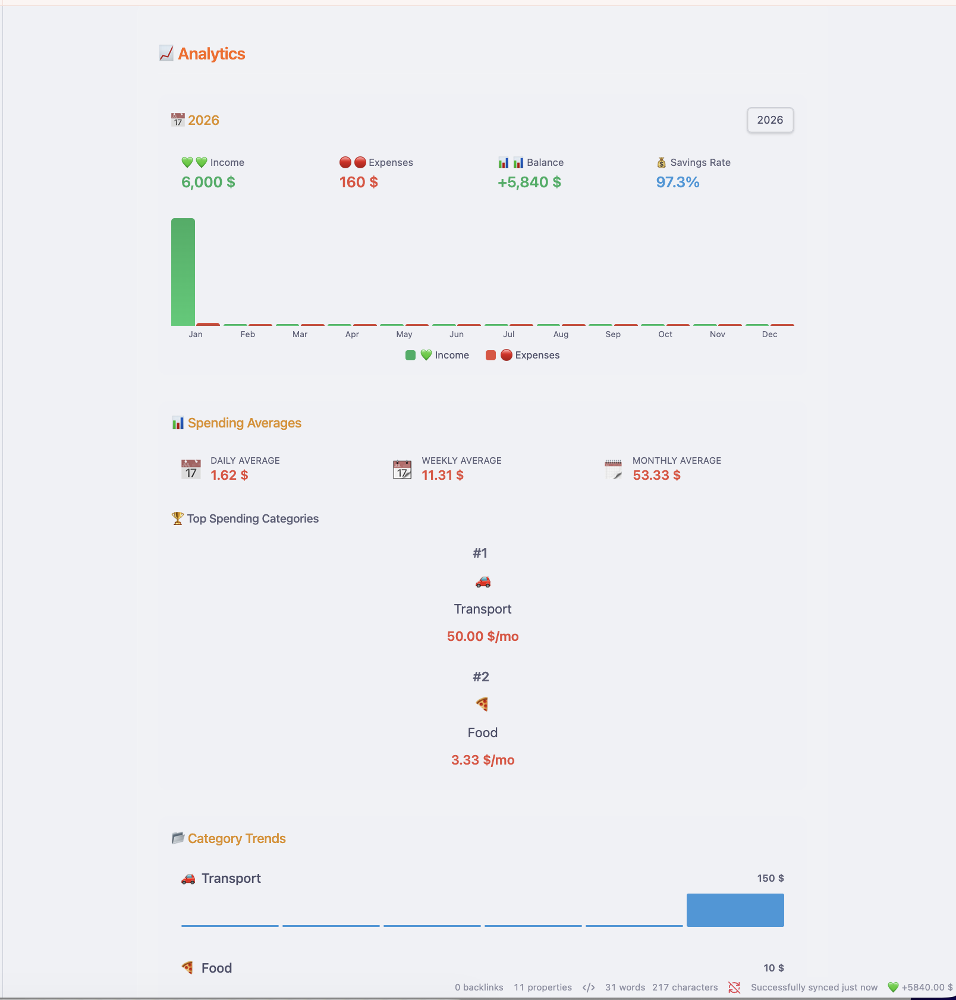
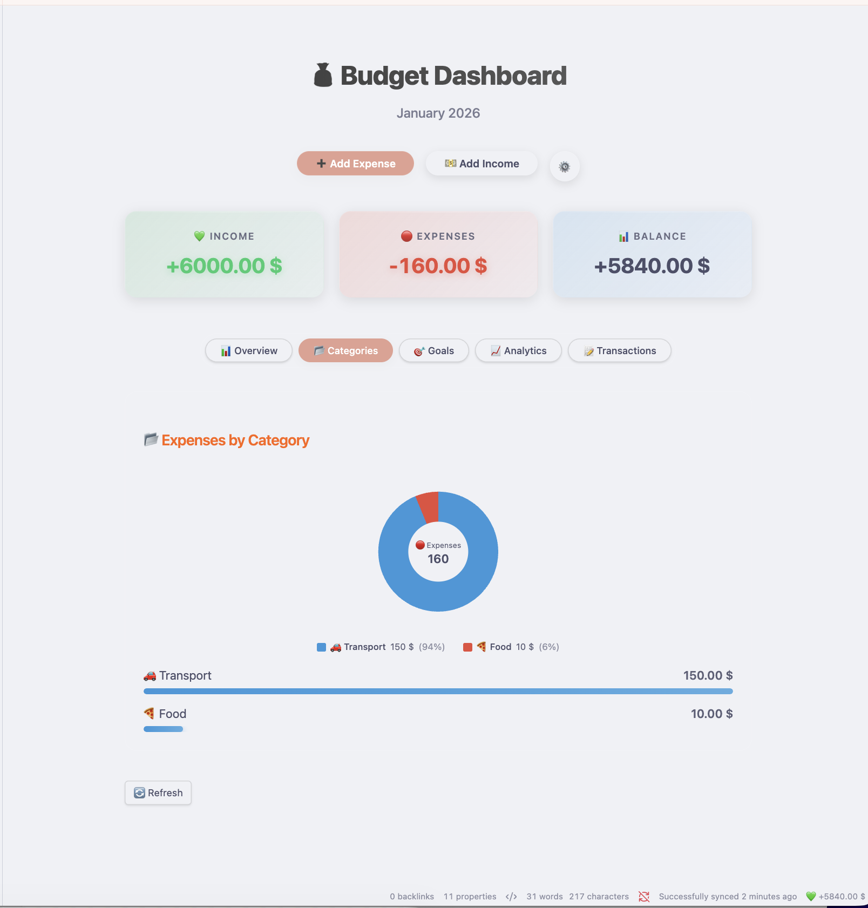
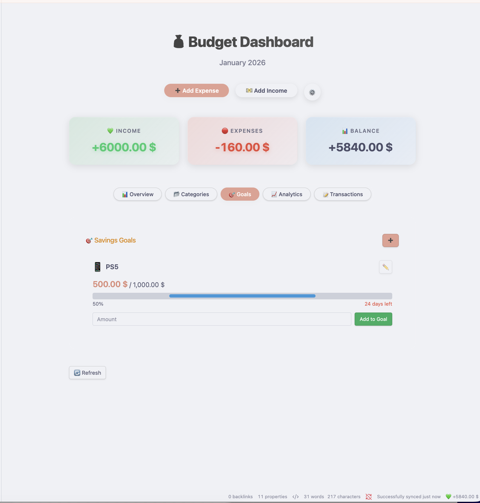
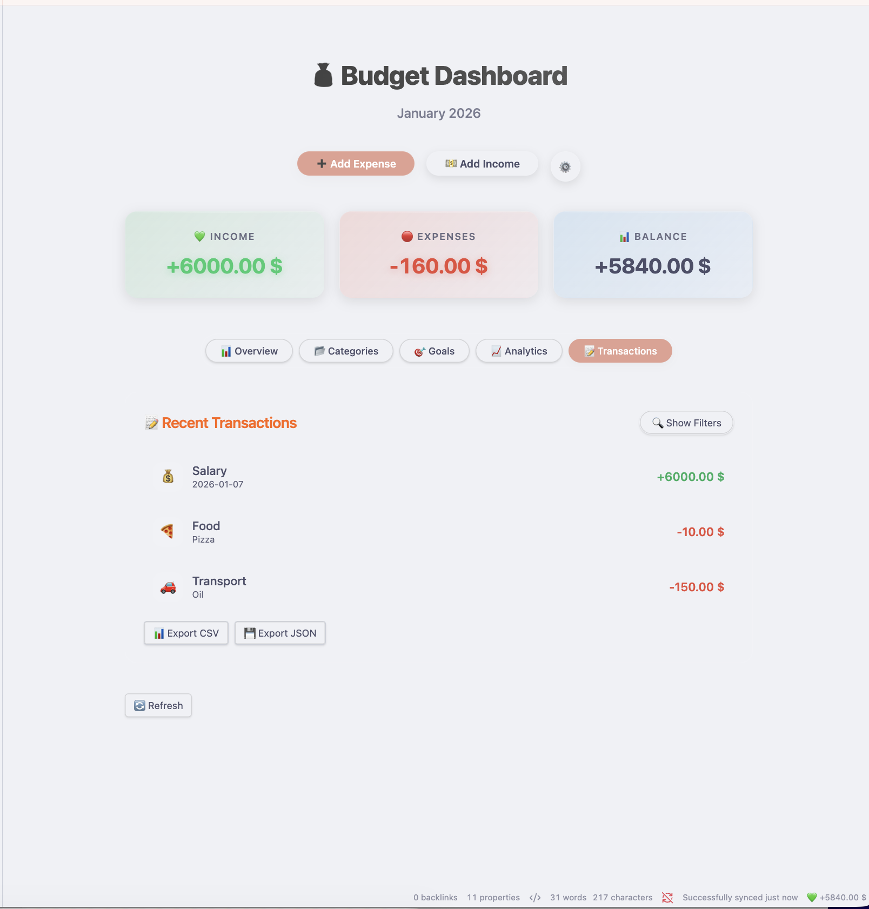
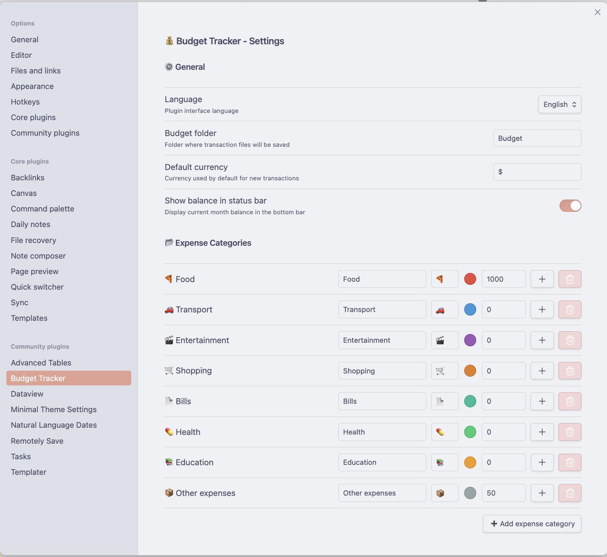
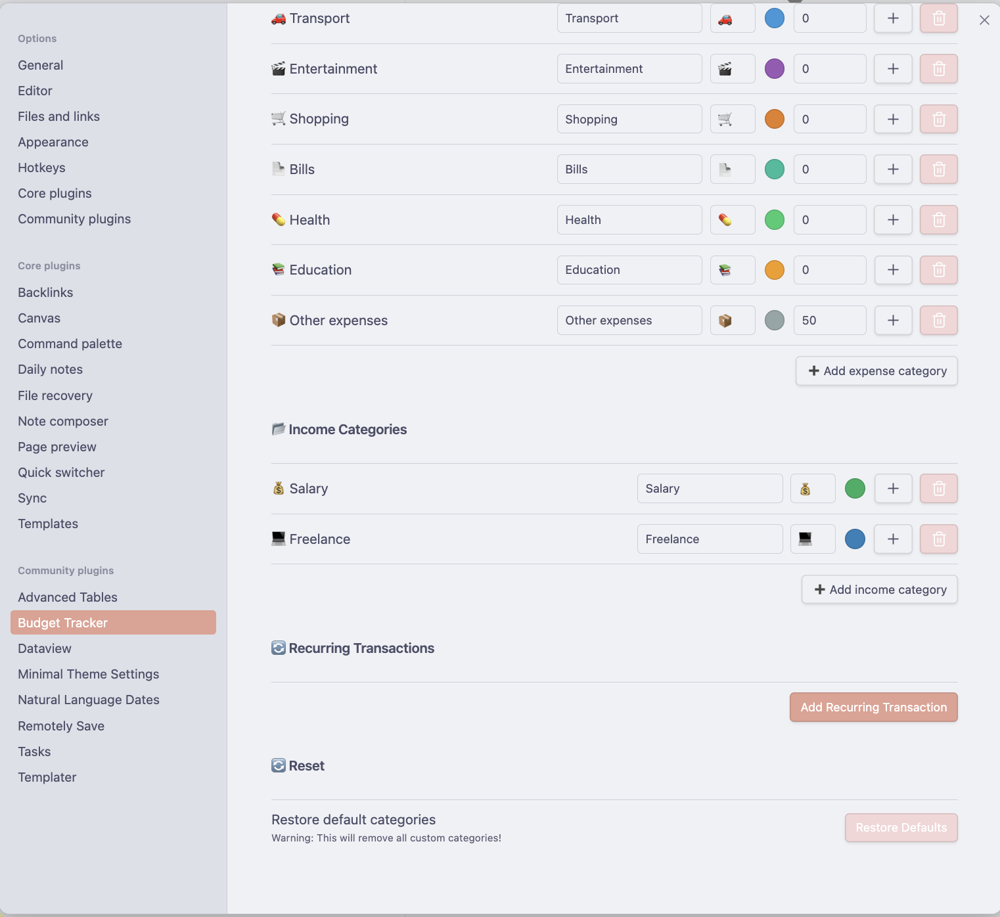

# Caishen - Budget Tracker

**Caishen** (God of Wealth) is a modern, privacy-focused budget management plugin for Obsidian. It helps you track your expenses, income, and savings goals directly within your vault, featuring a stunning "Vibrant Glass" dashboard.

*(Note: Add a screenshot of your dashboard here)*

## ✨ Features & Visual Tour

### 📊 Comprehensive Dashboard
Get a complete overview of your finances at a glance. Track income, expenses, and balance in real-time.

### 💸 Easy Transaction Entry
Quickly add income and expenses with intuitive forms. Support for recurring transactions included.

  
  

### 📈 Deep Analytics
Analyze spending trends over time and compare monthly performance.

### 🧩 Smart Categorization
Visualize your spending by category to see exactly where your money goes.

### 🎯 Savings Goals
Set financial targets and track your progress towards them.

### 📝 Transaction History
View and manage your recent activity in a clean, list format.

## ⚙️ Configuration
Customize categories, currency, and language settings to fit your needs.

  
  

## 🚀 How to Use

### Opening the Dashboard
1. Click the **Ribbon Icon** (Money Bag 💰) on the left sidebar.
2. Or open the Command Palette (`Ctrl/Cmd + P`) and search for **"Open Budget Dashboard"**.

### Adding Transactions
- Click the **+ Add Expense** or **+ Add Income** buttons on the dashboard.
- Fill in the amount, category, and optional details.
- Use the **Recurring** toggle if this is a repeating payment (e.g., subscription, rent).

### Managing Categories
- Go to **Settings > Categories** to manage your structure.
- Drag and drop to reorder or nest categories (if supported in future updates) or use the tree view to organize.

### Data & Analytics
- The specific **Analytics** tab provides yearly overviews and deeper insights into your spending habits.
- **Savings Rate** is automatically calculated based on your income vs. expenses.

## ⚙️ Settings

- **Currency**: Set your preferred currency symbol (e.g., $, €, PLN).
- **Language**: Switch between English and Polish.
- **Notifications**: Configure when to be alerted about upcoming recurring transactions.

## 📥 Installation

### From Community Plugins
1. Open Obsidian functionality **Settings** > **Community plugins**.
2. Turn off "Restricted mode".
3. Click **Browse** and search for **"Caishen Budget Tracker"**.
4. Click **Install** and then **Enable**.

### Manual Installation
1. Download the `main.js`, `manifest.json`, and `styles.css` from the latest Release.
2. Create a folder named `caishen-budget-tracker` in your vault's `.obsidian/plugins/` directory.
3. Put the downloaded files into that folder.
4. Reload Obsidian and enable the plugin.

## 🤝 Support & Contributing

If you find a bug or have a feature request, please [open an issue](https://github.com/malinowskij/budget-tracker/issues) on GitHub.

## � License

MIT License. See [LICENSE](LICENSE) for more information.
